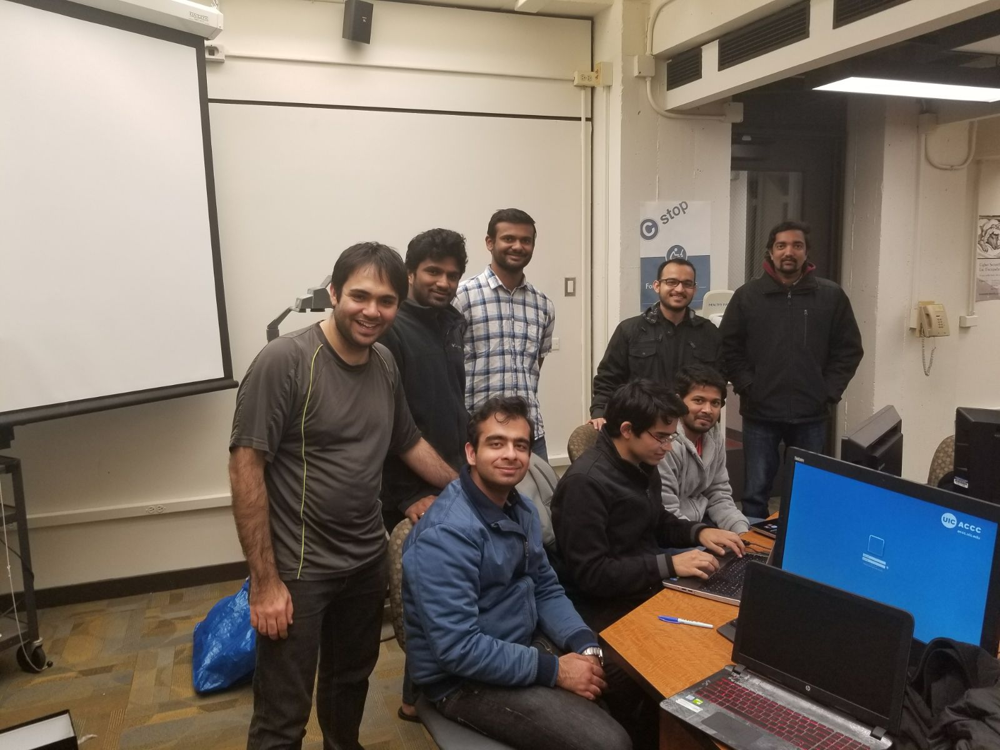

# Purpose #

Create a private cloud using Raspberry PIs (ARM architecture) and use Kubernetes 
for container orchastration to run MapReduce jobs using Apache Hadoop.  

### What is this repository for? ###

* A how-to guide for construction of cluster.
* Provide the resources required for the construction of the cluster. 

### Hardware required ###

* Raspberry PIs [[Buy](https://www.amazon.com/Raspberry-Pi-RASPBERRYPI3-MODB-1GB-Model-Motherboard/dp/B01CD5VC92)]
* Power suppy [[Buy](https://www.amazon.com/CanaKit-Raspberry-Supply-Adapter-Charger/dp/B00MARDJZ4/ref=pd_bxgy_147_2?_encoding=UTF8&psc=1&refRID=6M8CYG5AKF2YM9H09JBN)]
* SD card [[Buy](https://www.amazon.com/Samsung-MicroSD-Adapter-MB-ME32GA-AM/dp/B06XWN9Q99/ref=pd_bxgy_147_3?_encoding=UTF8&psc=1&refRID=6M8CYG5AKF2YM9H09JBN)]

### Assumptions ###

* We have 8 Raspberry PIs (1 Master, 7 Slaves).

### Repositories and images created and utilized ###

* Docker image using base as amr7 ubuntu with hadoop and java on top [Link to image: [amr7-ubuntu-hd](https://hub.docker.com/r/raghavendrasomannavar/amr7-ubuntu-hd/)]
* Shell scripts to automate the process of kubernetes cluster setup [Link to repo: [Kube-Construct](https://github.com/dark-shade/kube-construct)] 

### How do I get set up? ###

##### Without Kube-Construct #####

1. Power On the PIs.
2. Install an OS on all PIs [we will be using Hypriot] [[Link](https://github.com/hypriot/image-builder-rpi/releases)].
3. Configure network on all PIs [Use the steps mentioned here: [Link](https://gist.github.com/chatchavan/3c58511e3d48f478b0c2)]
4. Install Kubernetes on PIs [Use this blog: [Hypriot blog](https://blog.hypriot.com/post/setup-kubernetes-raspberry-pi-cluster/)] .
5. Setup Master [As mentioned in the Hypriot Blog].
6. Connect the slaves [As mentioned in the Hypriot Blog].
7. Setup Flannel [As mentioned in the Hypriot Blog].
8. Start the service by executing `kubectl run hw2 --image=raghavendrasomannavar/amr7/ubuntu-hd:1.0.0 --replicas=7 --port=80` on master.
9. Expose pods by executing `kubectl expose deployment hw2 --port 80` on master node.
10. Check if all containers are up and running by executing `kubectl get endpoints hw2` on master.
11. Deploy load balancer [As mentioned in the Hypriot Blog].
12. Deploy kubernetes dashboard [As mentioned in the Hypriot Blog].

##### With Kube-Construct #####

1. Follow till Step-2 above.
2. Execute `setupWifi.sh` on all nodes to setup wifi.
3. Use `setupMaster.sh` to setup the master and slave nodes.
4. Follow from Step-6 to Step-11.

### Setup video ###

* Link to the setup process video: [Link](https://youtu.be/h85AG6aAM0k)

### Limitations ###

* The nodes kept dropping from the cluster, although we were not able to pin point the cause but unstable 
power supply and bad configs seemed to be the most plausible cause.
* The number of failures were directly proportional to the size of image used.
* The cluster needed to be reset if master node was dropped.

Note: Some of these are known issues and concerns related to the tools and technologies utilized.

### Team members ###

* Sankul Rawat [[LinkedIn profile](https://www.linkedin.com/in/sankulrawat/)]
* Harsh P Bajaj [[LinkedIn profile](https://www.linkedin.com/in/harshbajaj543/)]
* Muttavarapu Sreeharsha [[LinkedIn profile](https://www.linkedin.com/in/sreeharsha-m-8a020569/)]
* Raghavendra Somannavar [[LinkedIn profile](https://www.linkedin.com/in/raghavendra-somannavar-a8583788/)]
* Harshit Pant [[LinkedIn profile](https://www.linkedin.com/in/harshit-pant-854468ba/)]
* Rushit Thakker [[LinkedIn profile](https://www.linkedin.com/in/rushit-thakker-7928a364/)]
* Jose George [[LinkedIn profile](https://www.linkedin.com/in/jose-george-90615885/)]
* Sai Sharan Nagulapalli [[LinkedIn profile](https://www.linkedin.com/in/sharandec7/)]

### Team Pic ###

### Cititations ###

[http://blog.kubernetes.io/2015/11/creating-a-Raspberry-Pi-cluster-running-Kubernetes-the-shopping-list-Part-1.html](http://blog.kubernetes.io/2015/11/creating-a-Raspberry-Pi-cluster-running-Kubernetes-the-shopping-list-Part-1.html)

[http://blog.kubernetes.io/2015/12/creating-raspberry-pi-cluster-running.html](http://blog.kubernetes.io/2015/12/creating-raspberry-pi-cluster-running.html)

[http://www.circuitbasics.com/raspberry-pi-basics-setup-without-monitor-keyboard-headless-mode/](http://www.circuitbasics.com/raspberry-pi-basics-setup-without-monitor-keyboard-headless-mode/)

[https://diyhacking.com/connect-raspberry-pi-to-laptop-display/](https://diyhacking.com/connect-raspberry-pi-to-laptop-display/)

[https://www.raspberrypi.org/documentation/remote-access/ssh/](https://www.raspberrypi.org/documentation/remote-access/ssh/)

[https://howchoo.com/g/nmrlzmq1ymn/how-to-install-docker-on-your-raspberry-pi](https://howchoo.com/g/nmrlzmq1ymn/how-to-install-docker-on-your-raspberry-pi)

[https://blog.hypriot.com/post/setup-kubernetes-raspberry-pi-cluster/](https://blog.hypriot.com/post/setup-kubernetes-raspberry-pi-cluster/)

[https://frillip.com/using-your-raspberry-pi-3-as-a-wifi-access-point-with-hostapd/](https://frillip.com/using-your-raspberry-pi-3-as-a-wifi-access-point-with-hostapd/)

[https://learn.adafruit.com/adafruits-raspberry-pi-lesson-3-network-setup/setting-up-wifi-with-occidentalis](https://learn.adafruit.com/adafruits-raspberry-pi-lesson-3-network-setup/setting-up-wifi-with-occidentalis)

[https://youtu.be/kT1vmK0r184](https://youtu.be/kT1vmK0r184)

[https://dqydj.com/raspberry-pi-hadoop-cluster-apache-spark-yarn/](https://dqydj.com/raspberry-pi-hadoop-cluster-apache-spark-yarn/)

[https://www.howtogeek.com/167195/how-to-change-your-raspberry-pi-or-other-linux-devices-hostname/](https://www.howtogeek.com/167195/how-to-change-your-raspberry-pi-or-other-linux-devices-hostname/)

[https://blog.hypriot.com/post/setup-kubernetes-raspberry-pi-cluster/](https://blog.hypriot.com/post/setup-kubernetes-raspberry-pi-cluster/)

[https://developer.ibm.com/recipes/tutorials/building-a-hadoop-cluster-with-raspberry-pi/](https://developer.ibm.com/recipes/tutorials/building-a-hadoop-cluster-with-raspberry-pi/)

[https://github.com/turbobytes/kubemr](https://github.com/turbobytes/kubemr)

[http://www.sajalkayan.com/post/kubemr.html](http://www.sajalkayan.com/post/kubemr.html)

[https://www.raspberrypi.org/documentation/remote-access/access-over-Internet/](https://www.raspberrypi.org/documentation/remote-access/access-over-Internet/)

[https://github.com/hortonworks/kubernetes-yarn/issues/8](https://github.com/hortonworks/kubernetes-yarn/issues/8)

[https://blog.gopheracademy.com/advent-2015/glow-map-reduce-for-golang/](https://blog.gopheracademy.com/advent-2015/glow-map-reduce-for-golang/)

[https://medium.com/@cedriclam/how-to-use-glow-with-kubernetes-22820d8f6270](https://medium.com/@cedriclam/how-to-use-glow-with-kubernetes-22820d8f6270)

[https://medium.com/@jasonicarter/how-to-hadoop-at-home-with-raspberry-pi-part-1-3b71f1b8ac4e](https://medium.com/@jasonicarter/how-to-hadoop-at-home-with-raspberry-pi-part-1-3b71f1b8ac4e)

[https://github.com/raspberrypi/noobs/blob/master/README.md](https://github.com/raspberrypi/noobs/blob/master/README.md)

[https://cdn-learn.adafruit.com/downloads/pdf/setting-up-a-raspberry-pi-with-noobs.pdf](https://cdn-learn.adafruit.com/downloads/pdf/setting-up-a-raspberry-pi-with-noobs.pdf)

[https://github.com/danisla/noobs-docker-pi](https://github.com/danisla/noobs-docker-pi)

[https://github.com/umiddelb/armhf/wiki/Get-Docker-up-and-running-on-the-RaspberryPi-(ARMv6)-in-four-steps-(Wheezy)](https://github.com/umiddelb/armhf/wiki/Get-Docker-up-and-running-on-the-RaspberryPi-(ARMv6)-in-four-steps-(Wheezy))

[http://www.jinkit.com/k8s-on-rpi/](http://www.jinkit.com/k8s-on-rpi/)

[https://github.com/sequenceiq/hadoop-docker](https://github.com/sequenceiq/hadoop-docker)

[https://blog.hypriot.com/post/new-docker-ui-portainer/](https://blog.hypriot.com/post/new-docker-ui-portainer/)

[https://gist.github.com/chatchavan/3c58511e3d48f478b0c2](https://gist.github.com/chatchavan/3c58511e3d48f478b0c2)

[https://kubernetes.io/docs/user-guide/docker-cli-to-kubectl/](https://kubernetes.io/docs/user-guide/docker-cli-to-kubectl/)

[https://github.com/kubernetes/dashboard](https://github.com/kubernetes/dashboard)

[https://github.com/dark-shade/kube-construct](https://github.com/dark-shade/kube-construct)

[https://kubernetes.io/docs/user-guide/docker-cli-to-kubectl/](https://kubernetes.io/docs/user-guide/docker-cli-to-kubectl/)

[https://kubernetes.io/docs/concepts/workloads/controllers/replicationcontroller/](https://kubernetes.io/docs/concepts/workloads/controllers/replicationcontroller/)

[https://docs.google.com/document/d/1zK7_PDgNRi2u0gU17EpEv6iQgoy7ZKU2vMxcKwrK_2I/edit?usp=drivesdk](https://docs.google.com/document/d/1zK7_PDgNRi2u0gU17EpEv6iQgoy7ZKU2vMxcKwrK_2I/edit?usp=drivesdk)

[https://docs.google.com/document/d/1zK7_PDgNRi2u0gU17EpEv6iQgoy7ZKU2vMxcKwrK_2I/edit?usp=drivesdk](https://docs.google.com/document/d/1zK7_PDgNRi2u0gU17EpEv6iQgoy7ZKU2vMxcKwrK_2I/edit?usp=drivesdk)

[https://docs.google.com/document/d/18uA9y834FcIWOx1vrujAMKakzrdRYFWKOI1n0VVarNU/edit?usp=drivesdk](https://docs.google.com/document/d/18uA9y834FcIWOx1vrujAMKakzrdRYFWKOI1n0VVarNU/edit?usp=drivesdk)

[https://stackoverflow.com/questions/6264596/simulating-enter-keypress-in-bash-script](https://stackoverflow.com/questions/6264596/simulating-enter-keypress-in-bash-script)

[https://blog.hypriot.com/post/setup-kubernetes-raspberry-pi-cluster/](https://blog.hypriot.com/post/setup-kubernetes-raspberry-pi-cluster/)

[https://github.com/eliaslevy/docker-hadoop/tree/master/base](https://github.com/eliaslevy/docker-hadoop/tree/master/base)